# Prueba Técnica Alan Giovanni Torres Mora
## Demostracion

                USUARIO ALAN
email 1:
    ejemplo1@gmail.com
password1:
    123456789
                USUARIO MICHELLE
email2:
    ejemplo2@gmail.com
password2:
    123456789

Nota: La app esta desplegada en render, por lo que puede tomar unos minutos en cargar debido a que es una version gratuita y se tiene que activar el servidor

## Planificación y arquitectura

Como domino el stack MERN muy bien, decidí irme por esa opción. La arquitectura es cliente-servidor de 3 capas (Frontend, Backend, Base de datos), con autenticaciones mediante cookies y gestión de validación en el backend para un acceso autorizado.

**MongoDB**: Esta es mi base de datos. La tomé porque es una API de base de datos no relacional, gratuita y de acceso por internet. Podría haber sido Supabase con PostgreSQL para hacerlo relacional.

**Express**: Es la parte encargada del servidor. Aquí configuramos los Modelos, las Rutas y los Controladores. Todo lo que no tenga que ver con el alcance del usuario será implementado aquí: generación de tokens, endpoints, conexión a la base de datos.

**React**: Parte del frontend que hará display de toda la información que nos brindará el backend. De igual forma, aquí existen endpoints únicos para el front que no tienen que ver con el backend, pero si necesitamos de una acción del backend usaremos `axios` para que exista comunicación (el backend implementa `cors` para mantener un canal de comunicación).

**NodeJS**: Mi gestor de paquetes encargado de la parte de descarga de dependencias y el entorno para crear nuestro servidor.

## Arquitectura

### Backend

Dentro del backend, el programa principal que ejecutará todo es `index.js`, sin embargo, debe haber delegación de responsabilidades como rutas, controladores, modelos, middlewares y utilidades (base de datos y JWT para generar token) para un código más limpio dentro del API REST.

#### index.js

Hace uso de las variables de entorno por lo que requerimos de la librería `dotenv`. Para generar el servidor como tal se usa `express`. Como parte importante necesitamos middlewares para que se puedan leer los formularios con `urlencoded`, `json` para poder trabajar con JSONs, `cookie-parser` ya que estamos manejando las sesiones mediante cookies y `cors` que sirve para tener un canal de comunicación con el frontend cuando de momento no exista un entorno de producción.

De ahí pasamos a las rutas donde hay 2 posibles caminos:  
- Para autenticarte y entrar al sistema  
- Para las acciones que pidan de todo el ejercicio CRUD de usuarios  

La parte del escucha es importante: hay que definirle un puerto y hacer una conexión a nuestra base de datos.

#### routes/

Esta carpeta contiene 2 routers que llevan a diferentes endpoints. Básicamente aquí se define en su totalidad el endpoint y se les asigna su controlador.

Un punto importante es el middleware para verificar si estás autenticado. Si no inicias sesión, no podrás ver la página de inicio ni hacer cambios. Se requiere sí o sí de una cookie que es validada en la siguiente parte.

#### lib/usuarioAuth.middleware.js

Esta es una función para comprobar si una cookie existe o es válida para ingresar al sistema. Rescatamos las cookies del navegador, las decodificamos con nuestro secreto que está en las variables de entorno.

Hacemos procesos de validación para verificar si existe o si es inválida. Ya una vez pasado este proceso, retornamos al usuario mediante su id y con eso se le permite avanzar a la próxima función.

#### controllers/

Aquí cada archivo ejecutará las respectivas funciones que debe hacer cada endpoint con su correspondiente acción.

### Frontend

Todo el código como tal está dentro de la carpeta `src`.

- **assets/**: Son los logos de mi página web.  
- **components/**: Son los elementos de la barra de navegación dinámica. Si estás en el login no te sale ninguna opción. Sin embargo, si estás registrado como corresponde, te saludará con tu nombre y tendrás las acciones de volver y cerrar sesión.  
- **lib/**: Es la implementación de `axios` (similar a jQuery.AJAX), donde establecemos una cadena de conexión dinámica preguntando si estamos en entorno de desarrollo o producción.  
- **paginas/**: Son las vistas como tal para el Login, el Home, una página especial para editar y otra para crear.  
- **store/**: En React necesitamos un almacén global para transportar datos importantes, como saber quién es el usuario logueado, si su sesión con su cookie es buena o ya expiró, o si simplemente desea salir de su sesión. Esto es importante ya que se usará este elemento en las partes donde se necesite verificación obligatoria.  
- **App.jsx**: Es la página principal que permite los enrutamientos dinámicos con autenticaciones en base al estado global del usuario (saber si un usuario es válido y verificar que su token existe). Aquí establecemos los endpoints del frontend.  
- **main.jsx**: Es la aplicación web como tal. Como todo quedó definido dentro de `App`, aquí solamente se le pasa un modo estricto (`React.StrictMode`) y se renderiza el componente `App`.

## Pruebas con Postman para la API
Traer a todos los usuarios
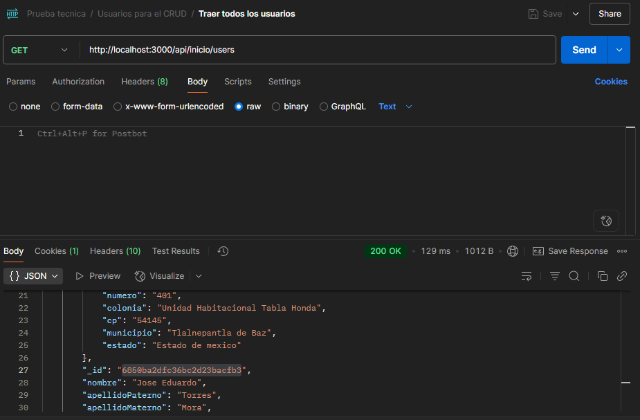
Crear un usuario
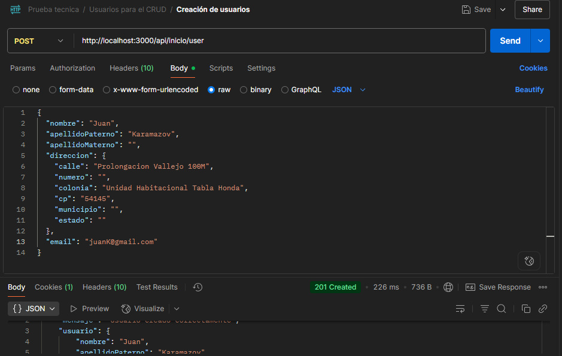
Traer a un solo usuario
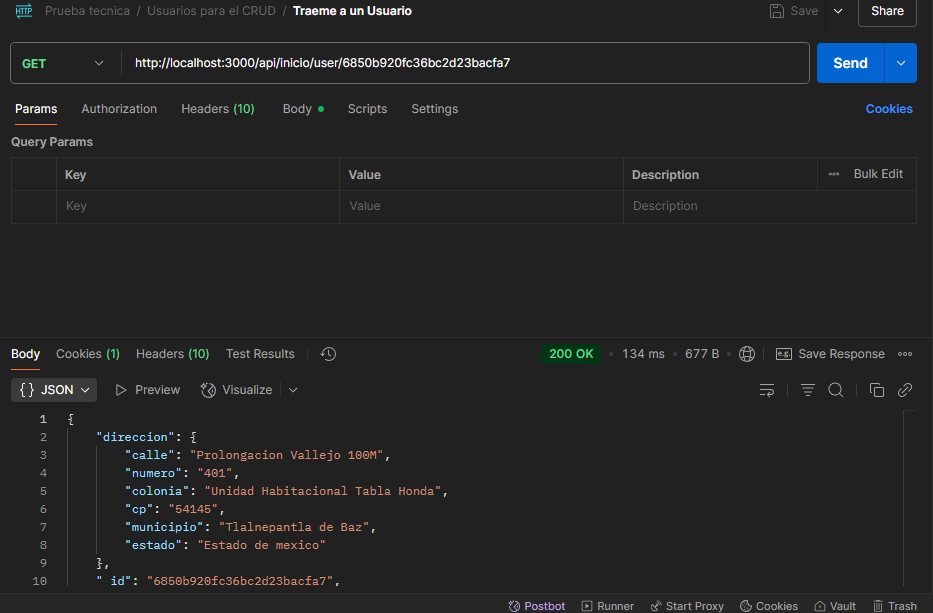
Eliminame a un usuario
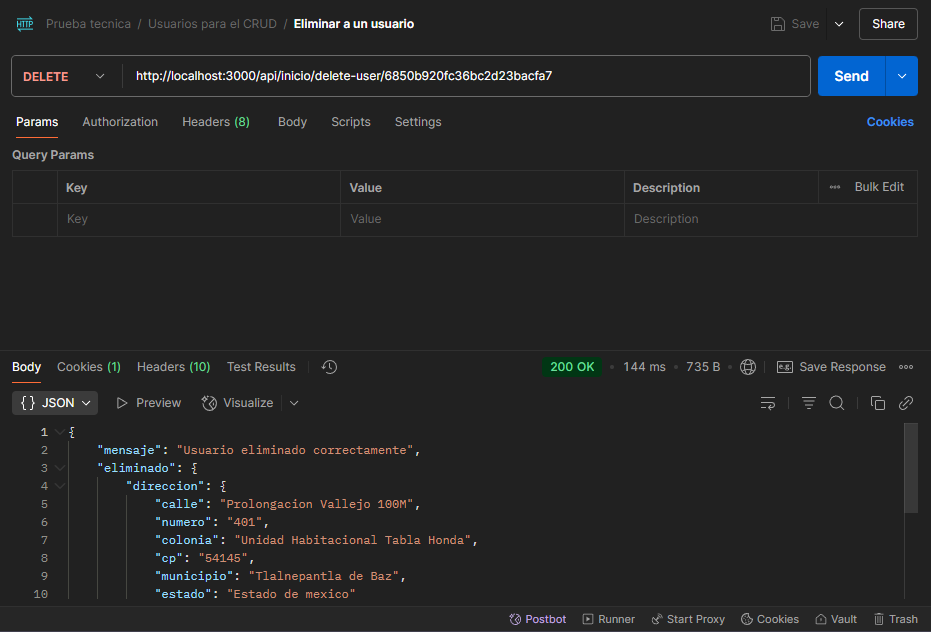
Editame este usuario
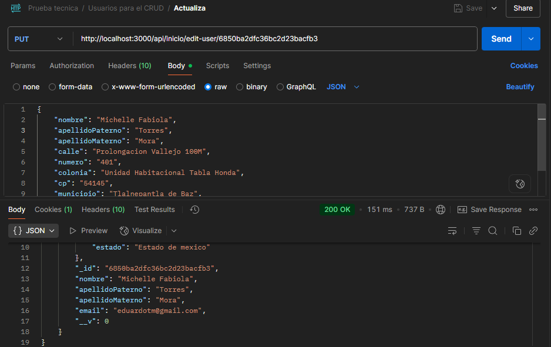

## Vistas de la pagina web
Login
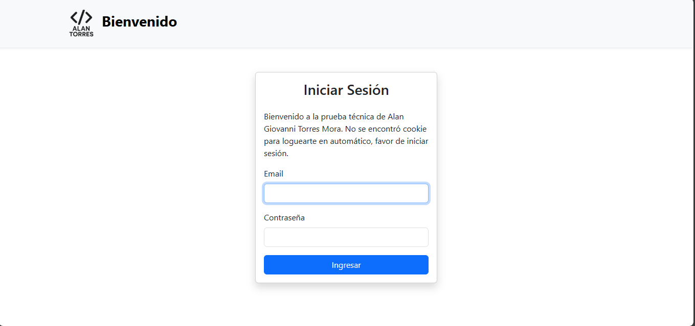
Inicio
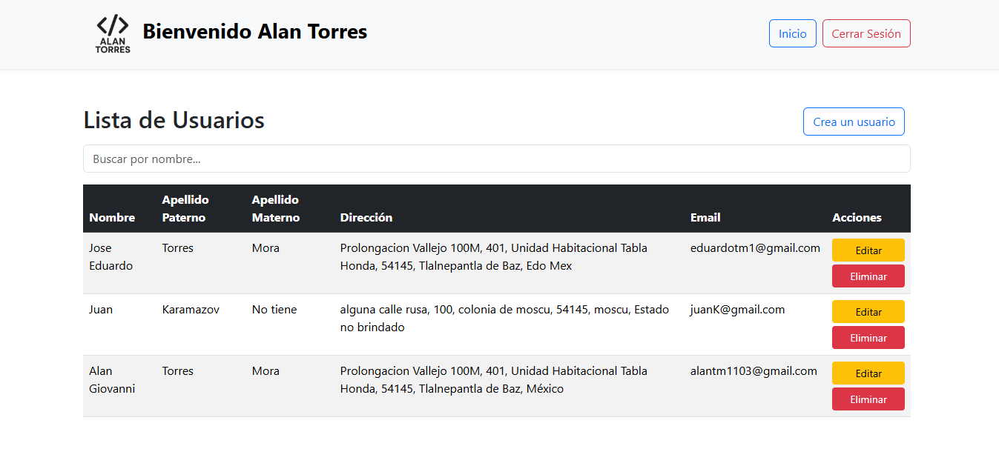
Ejemplo de busqueda
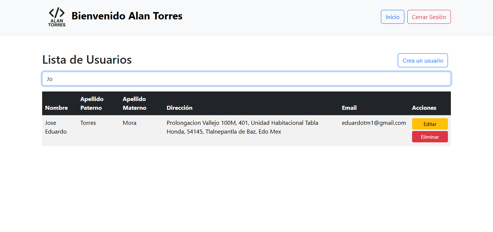
Formulario para crear
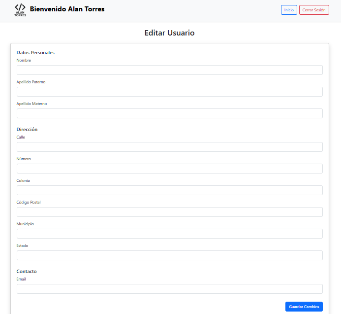
Edicion de un elemento
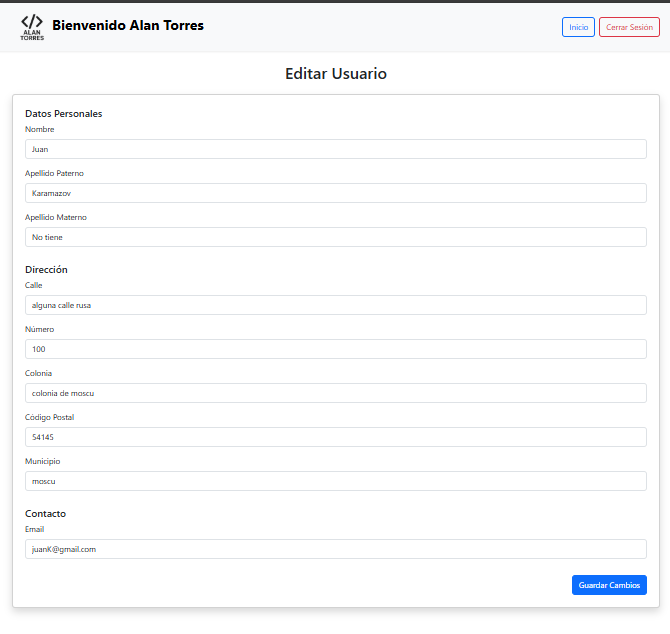
Base de datos de Mongo usuarios MASTER
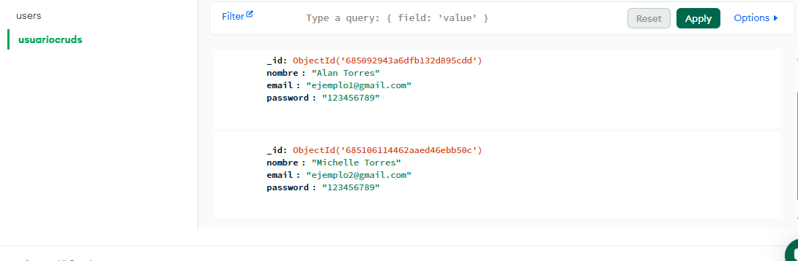
Base de datos de Mongo para los usuarios del CRUD
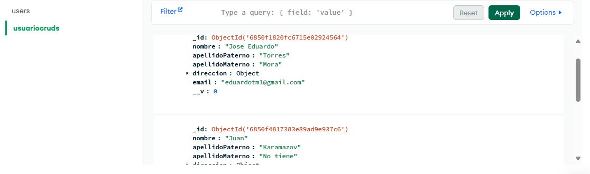